# Buyer Universe Creation Process

This document details the complete process for creating a Buyer Universe (Industry Tracker), including all AI prompts, data transformations, and database storage.

## Process Flow Diagram

```mermaid
graph TD
    subgraph "1. User Input Methods"
        A[User Creates New Tracker] --> B{Input Method?}
        B -->|Quick Import| C[Paste Notes/Transcript]
        B -->|AI Research| D[Enter Industry Name]
        B -->|Document Upload| E[Upload PDF/DOCX]
    end

    subgraph "2. AI Processing Pipeline"
        C --> F[analyze-tracker-notes<br/>Edge Function]
        D --> G[generate-ma-guide<br/>Edge Function]
        E --> H[parse-tracker-documents<br/>Edge Function]
        
        F -->|Claude Tool Call| I[Extract Criteria JSON]
        G -->|12-Phase Generation| J[Full M&A Guide + Criteria]
        H -->|Document Parsing| K[Extract Text Content]
        K --> F
    end

    subgraph "3. Criteria Extraction"
        I --> L[Raw Text Criteria]
        J --> M{Extraction Method}
        M -->|Primary| N[Regex Extraction<br/>from Guide Sections]
        M -->|Fallback| O[AI Tool Call<br/>extract_all_criteria]
        N --> L
        O --> L
    end

    subgraph "4. Structured Parsing"
        L --> P[parse-fit-criteria<br/>Edge Function]
        P -->|Claude Tool Call| Q[Structured JSONB]
        Q --> R{Validation}
        R -->|Pass| S[Clean Criteria Object]
        R -->|Fail| T[Placeholder Detection<br/>& Correction]
        T --> S
    end

    subgraph "5. Database Storage"
        S --> U[(industry_trackers Table)]
        U --> V[size_criteria JSONB]
        U --> W[service_criteria JSONB]
        U --> X[geography_criteria JSONB]
        U --> Y[buyer_types_criteria JSONB]
        U --> Z[ma_guide_content TEXT]
        U --> AA[ma_guide_qa_context JSONB]
    end

    subgraph "6. Deal Scoring Connection"
        V --> AB[score-buyer-deal<br/>Edge Function]
        W --> AB
        X --> AB
        Y --> AB
        AB --> AC[Composite Fit Score]
    end

    style A fill:#e1f5fe
    style U fill:#fff3e0
    style AC fill:#e8f5e9
```



## Legend

| Node Style | Meaning |
|------------|---------|
| Blue fill (`#e1f5fe`) | User entry point |
| Orange fill (`#fff3e0`) | Database storage |
| Green fill (`#e8f5e9`) | Final output |
| Default | Processing steps |

---

## Detailed Process Documentation

### 1. Input Methods

#### Method A: Quick Import from Notes
- **Source File**: `src/components/TrackerNotesSection.tsx`
- **Edge Function**: `supabase/functions/analyze-tracker-notes/index.ts`
- **Use Case**: User pastes call transcript, meeting notes, or existing criteria text

#### Method B: AI Research (Full M&A Guide)
- **Source File**: `src/components/AIResearchSection.tsx`
- **Edge Function**: `supabase/functions/generate-ma-guide/index.ts`
- **Master Prompt**: `src/lib/maGuidePrompt.ts`
- **Use Case**: Generate comprehensive industry analysis from scratch

#### Method C: Document Upload
- **Source File**: `src/components/DocumentUploadSection.tsx`
- **Edge Function**: `supabase/functions/parse-tracker-documents/index.ts`
- **Use Case**: Upload existing PDF/DOCX with buyer criteria

---

### 2. AI Processing: analyze-tracker-notes

**Purpose**: Extract structured criteria from unstructured notes/transcripts

**Claude System Prompt**:
```
You are an M&A advisor assistant specializing in analyzing call notes and transcripts to extract buyer acquisition criteria.

Your task is to analyze the provided notes and extract structured information about what types of companies this buyer is looking to acquire.

Focus on extracting:
1. Size criteria (revenue ranges, EBITDA ranges, employee counts)
2. Service/industry preferences (target sectors, service types)
3. Geographic preferences (target regions, exclusions)
4. Business model preferences (recurring revenue, customer types)
5. Deal breakers and exclusions

Be precise and only extract information that is explicitly stated or strongly implied in the notes.
```

**Tool Schema**:
```typescript
{
  name: "extract_buyer_criteria",
  description: "Extract structured buyer acquisition criteria from notes",
  input_schema: {
    type: "object",
    properties: {
      size_criteria: {
        type: "string",
        description: "Revenue/EBITDA/size requirements as descriptive text"
      },
      service_criteria: {
        type: "string", 
        description: "Target services, industries, sectors"
      },
      geography_criteria: {
        type: "string",
        description: "Geographic preferences and exclusions"
      },
      buyer_types_criteria: {
        type: "string",
        description: "Types of buyers (PE, strategic, etc.)"
      },
      key_quotes: {
        type: "array",
        items: { type: "string" },
        description: "Direct quotes supporting the criteria"
      },
      confidence_notes: {
        type: "string",
        description: "Notes on data quality and gaps"
      }
    },
    required: ["size_criteria", "service_criteria", "geography_criteria"]
  }
}
```

---

### 3. AI Processing: generate-ma-guide

**Purpose**: Generate comprehensive M&A industry guide with buyer criteria

**12-Phase Generation Process**:

| Phase | Name | Purpose |
|-------|------|---------|
| 1 | Industry Overview | Market size, growth, key players |
| 2 | Market Dynamics | Trends, drivers, challenges |
| 3A | Valuation Multiples | EV/EBITDA, EV/Revenue ranges |
| 3B | **Buyer Fit Criteria** | Critical: Extract target criteria |
| 4 | **Structured Output** | JSON criteria extraction |
| 5 | Competitive Landscape | Major acquirers, recent deals |
| 6 | Due Diligence Focus | Key areas for investigation |
| 7 | Deal Structure | Typical terms, earnouts |
| 8 | Integration Playbook | Post-acquisition priorities |
| 9 | Risk Factors | Deal breakers, red flags |
| 10 | Q&A Context | Common buyer questions |
| 11 | Appendix | Data sources, methodology |
| 12 | Executive Summary | Key takeaways |

**Phase 3B Prompt (Buyer Fit Criteria)**:
```
## PHASE 3B: BUYER FIT CRITERIA SUMMARY

Based on your analysis of the ${industry} industry, provide a comprehensive summary of ideal target company criteria that PE-backed buyers typically seek.

Structure your response with these exact headers:

### SIZE CRITERIA
- Minimum and maximum revenue ranges
- EBITDA thresholds (both minimum and preferred)
- Employee count considerations
- Be specific with dollar amounts (e.g., "$5M-$50M revenue")

### SERVICE/OFFERING CRITERIA  
- Core services that are most attractive
- Adjacent services that add value
- Services to avoid or that indicate poor fit
- Technology/capability requirements

### GEOGRAPHIC CRITERIA
- Primary target regions
- Expansion geographies of interest
- Geographic exclusions or limitations
- Multi-location vs single-location preferences

### BUYER TYPE CRITERIA
- Platform vs add-on considerations
- Owner transition requirements
- Management team expectations
- Cultural fit factors

CRITICAL: Use specific numbers and ranges, not vague terms like "mid-market" or "growth-stage"
```

**Phase 4 Prompt (Structured Extraction)**:
```
Based on the buyer fit criteria section above, extract the criteria into a structured format.

Use the extract_all_criteria tool to output the criteria as structured JSON.

IMPORTANT DISTINCTIONS:
- "ebitda_multiple_low/high" = Valuation multiples (e.g., 4x-7x EBITDA)
- "min_ebitda/max_ebitda" = Dollar amounts (e.g., $1M-$10M)
- Never confuse multiples with dollar values

If a value is not explicitly stated, use null rather than guessing.
```

**Master System Prompt Location**: `src/lib/maGuidePrompt.ts`

Contains:
- Quality thresholds (minimum word count, table count)
- Industry-specific context injection
- Formatting requirements
- Citation and evidence standards

---

### 4. Criteria Extraction Methods

#### Primary: Regex Extraction
Extracts content between section headers in the generated guide:

```typescript
// From generate-ma-guide/index.ts
const extractSection = (content: string, sectionName: string): string => {
  const patterns = [
    new RegExp(`### ${sectionName}[\\s\\S]*?(?=###|$)`, 'i'),
    new RegExp(`## ${sectionName}[\\s\\S]*?(?=##|$)`, 'i'),
    new RegExp(`${sectionName}:[\\s\\S]*?(?=\\n\\n|$)`, 'i')
  ];
  
  for (const pattern of patterns) {
    const match = content.match(pattern);
    if (match) return match[0].trim();
  }
  return '';
};

const sizeCriteria = extractSection(guideContent, 'SIZE CRITERIA');
const serviceCriteria = extractSection(guideContent, 'SERVICE.*CRITERIA');
const geographyCriteria = extractSection(guideContent, 'GEOGRAPHIC CRITERIA');
const buyerTypesCriteria = extractSection(guideContent, 'BUYER TYPE CRITERIA');
```

#### Fallback: AI Tool Call
If regex extraction fails or returns insufficient content:

```typescript
{
  name: "extract_all_criteria",
  description: "Extract all buyer fit criteria from the M&A guide",
  input_schema: {
    type: "object",
    properties: {
      size_criteria: { type: "string" },
      service_criteria: { type: "string" },
      geography_criteria: { type: "string" },
      buyer_types_criteria: { type: "string" }
    },
    required: ["size_criteria", "service_criteria", "geography_criteria", "buyer_types_criteria"]
  }
}
```

---

### 5. Structured Parsing: parse-fit-criteria

**Purpose**: Convert raw text criteria into structured JSONB for database storage and scoring

**Edge Function**: `supabase/functions/parse-fit-criteria/index.ts`

**Claude System Prompt**:
```
You are a precise data extraction assistant for M&A buyer criteria. Your job is to parse natural language descriptions of acquisition criteria into structured JSON format.

CRITICAL RULES:
1. NEVER use placeholder values like [X], TBD, "varies", or "to be determined"
2. If a value is not explicitly stated, use null
3. Distinguish between:
   - VALUATION MULTIPLES (e.g., "4x-7x EBITDA") → ebitda_multiple_low: 4, ebitda_multiple_high: 7
   - DOLLAR AMOUNTS (e.g., "$2M-$10M EBITDA") → min_ebitda: 2000000, max_ebitda: 10000000
4. All currency values should be in raw numbers (no formatting)
5. Geographic regions should use standardized names (e.g., "Southeast US", "Northeast US")
6. Service categories should be normalized to industry-standard terms
```

**Tool Schema (Size Criteria)**:
```typescript
{
  name: "parse_size_criteria",
  description: "Parse size-related acquisition criteria",
  input_schema: {
    type: "object",
    properties: {
      min_revenue: { type: "number", description: "Minimum revenue in dollars" },
      max_revenue: { type: "number", description: "Maximum revenue in dollars" },
      sweet_spot_revenue: { type: "number", description: "Ideal revenue target" },
      min_ebitda: { type: "number", description: "Minimum EBITDA in dollars" },
      max_ebitda: { type: "number", description: "Maximum EBITDA in dollars" },
      sweet_spot_ebitda: { type: "number", description: "Ideal EBITDA target" },
      ebitda_multiple_low: { type: "number", description: "Low end of valuation multiple" },
      ebitda_multiple_high: { type: "number", description: "High end of valuation multiple" },
      min_employees: { type: "number" },
      max_employees: { type: "number" },
      notes: { type: "string", description: "Additional context" }
    }
  }
}
```

**Tool Schema (Service Criteria)**:
```typescript
{
  name: "parse_service_criteria",
  description: "Parse service/industry criteria",
  input_schema: {
    type: "object",
    properties: {
      target_services: {
        type: "array",
        items: { type: "string" },
        description: "List of target service types"
      },
      excluded_services: {
        type: "array", 
        items: { type: "string" },
        description: "Services to avoid"
      },
      required_capabilities: {
        type: "array",
        items: { type: "string" },
        description: "Must-have capabilities"
      },
      preferred_business_model: { type: "string" },
      revenue_model_preferences: {
        type: "array",
        items: { type: "string" },
        description: "e.g., recurring, project-based, retainer"
      },
      notes: { type: "string" }
    }
  }
}
```

**Tool Schema (Geography Criteria)**:
```typescript
{
  name: "parse_geography_criteria", 
  description: "Parse geographic criteria",
  input_schema: {
    type: "object",
    properties: {
      target_regions: {
        type: "array",
        items: { type: "string" },
        description: "Primary target regions"
      },
      expansion_regions: {
        type: "array",
        items: { type: "string" },
        description: "Secondary/expansion regions"
      },
      excluded_regions: {
        type: "array",
        items: { type: "string" },
        description: "Regions to avoid"
      },
      headquarters_preference: { type: "string" },
      multi_location_preference: { type: "string" },
      notes: { type: "string" }
    }
  }
}
```

**Tool Schema (Buyer Types Criteria)**:
```typescript
{
  name: "parse_buyer_types_criteria",
  description: "Parse buyer type and deal structure criteria",
  input_schema: {
    type: "object",
    properties: {
      platform_vs_addon: { type: "string", description: "Platform only, add-on only, or both" },
      owner_transition_requirements: { type: "string" },
      management_retention_preference: { type: "string" },
      deal_structure_preferences: {
        type: "array",
        items: { type: "string" }
      },
      cultural_requirements: {
        type: "array",
        items: { type: "string" }
      },
      notes: { type: "string" }
    }
  }
}
```

---

### 6. Validation & Quality Checks

**Placeholder Detection** (from `src/lib/criteriaValidation.ts`):
```typescript
const PLACEHOLDER_PATTERNS = [
  /\[.*?\]/g,           // [X], [TBD], [value]
  /\{.*?\}/g,           // {placeholder}
  /TBD/gi,
  /to be determined/gi,
  /varies/gi,
  /contact for details/gi,
  /ask about/gi,
  /\$X+/gi,             // $XX, $XXX
  /X+M/gi,              // XM, XXM (revenue placeholders)
];

export function detectPlaceholders(criteria: unknown): string[] {
  const issues: string[] = [];
  const checkValue = (value: unknown, path: string) => {
    if (typeof value === 'string') {
      for (const pattern of PLACEHOLDER_PATTERNS) {
        if (pattern.test(value)) {
          issues.push(`Placeholder detected at ${path}: ${value}`);
        }
      }
    }
  };
  // Recursive check...
  return issues;
}
```

**M&A Guide Quality Validation**:
```typescript
interface QualityMetrics {
  wordCount: number;           // Minimum: 3000
  tableCount: number;          // Minimum: 3
  hasPlaceholders: boolean;    // Must be false
  industryMentions: number;    // Minimum: 10
  hasCriticalSections: boolean; // Must include BUYER FIT CRITERIA
}
```

---

### 7. Database Schema

**Table**: `industry_trackers`

| Column | Type | Purpose |
|--------|------|---------|
| `id` | UUID | Primary key |
| `industry_name` | TEXT | Display name |
| `fit_criteria_size` | TEXT | Raw size criteria text |
| `fit_criteria_service` | TEXT | Raw service criteria text |
| `fit_criteria_geography` | TEXT | Raw geography criteria text |
| `fit_criteria_buyer_types` | TEXT | Raw buyer types text |
| `size_criteria` | JSONB | Structured size criteria |
| `service_criteria` | JSONB | Structured service criteria |
| `geography_criteria` | JSONB | Structured geography criteria |
| `buyer_types_criteria` | JSONB | Structured buyer types criteria |
| `ma_guide_content` | TEXT | Full M&A guide markdown |
| `ma_guide_qa_context` | JSONB | Q&A pairs for chat |
| `documents` | JSONB | Uploaded document metadata |
| `documents_analyzed_at` | TIMESTAMP | Last document analysis |
| `scoring_behavior` | JSONB | Custom scoring rules |
| `kpi_scoring_config` | JSONB | Industry-specific KPIs |

---

### 8. Criteria Schema Definition

**Location**: `src/lib/criteriaSchema.ts`

```typescript
export interface SizeCriteria {
  min_revenue?: number | null;
  max_revenue?: number | null;
  sweet_spot_revenue?: number | null;
  min_ebitda?: number | null;
  max_ebitda?: number | null;
  sweet_spot_ebitda?: number | null;
  ebitda_multiple_low?: number | null;
  ebitda_multiple_high?: number | null;
  min_employees?: number | null;
  max_employees?: number | null;
  notes?: string | null;
}

export interface ServiceCriteria {
  target_services?: string[] | null;
  excluded_services?: string[] | null;
  required_capabilities?: string[] | null;
  preferred_business_model?: string | null;
  revenue_model_preferences?: string[] | null;
  notes?: string | null;
}

export interface GeographyCriteria {
  target_regions?: string[] | null;
  expansion_regions?: string[] | null;
  excluded_regions?: string[] | null;
  headquarters_preference?: string | null;
  multi_location_preference?: string | null;
  notes?: string | null;
}

export interface BuyerTypesCriteria {
  platform_vs_addon?: string | null;
  owner_transition_requirements?: string | null;
  management_retention_preference?: string | null;
  deal_structure_preferences?: string[] | null;
  cultural_requirements?: string[] | null;
  notes?: string | null;
}
```

---

## Source File References

| File | Purpose |
|------|---------|
| `src/pages/NewTracker.tsx` | Tracker creation page |
| `src/components/TrackerNotesSection.tsx` | Notes input UI |
| `src/components/AIResearchSection.tsx` | AI research trigger UI |
| `src/components/DocumentUploadSection.tsx` | Document upload UI |
| `supabase/functions/analyze-tracker-notes/index.ts` | Notes → Criteria extraction |
| `supabase/functions/generate-ma-guide/index.ts` | Full M&A guide generation |
| `supabase/functions/parse-fit-criteria/index.ts` | Text → JSONB parsing |
| `supabase/functions/parse-tracker-documents/index.ts` | Document processing |
| `src/lib/maGuidePrompt.ts` | Master prompt configuration |
| `src/lib/criteriaSchema.ts` | TypeScript schema definitions |
| `src/lib/criteriaValidation.ts` | Validation utilities |

---

## Connection to Deal Scoring

Once criteria are stored, they feed into the deal scoring system:

1. **score-buyer-deal** compares deal attributes against structured criteria
2. Each criteria dimension produces a sub-score (0-100)
3. Weights (configurable per tracker) determine final composite score
4. Scores stored in `buyer_deal_scores` table

See: `docs/architecture/deal-scoring-algorithm.md` (if exists) for scoring details.
