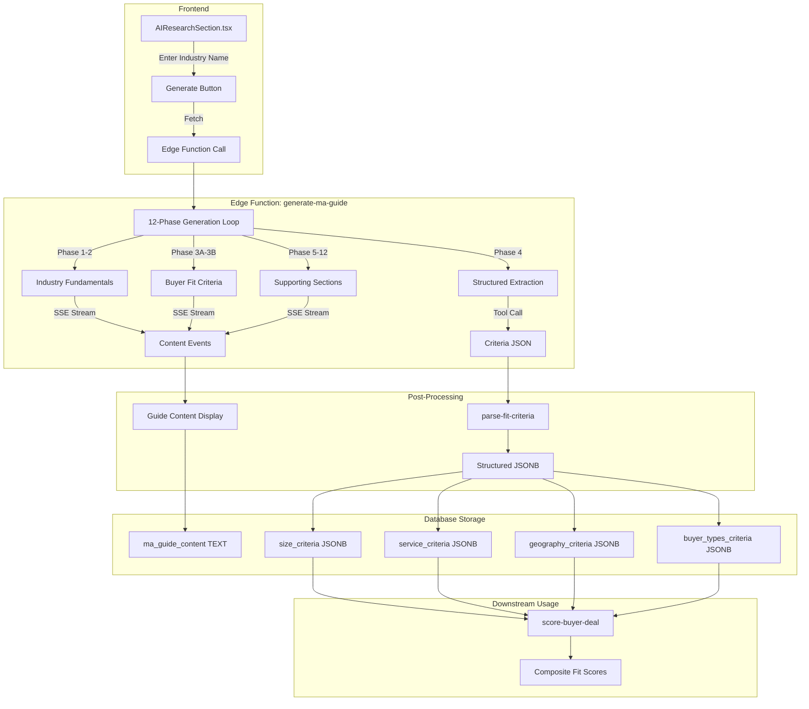

# M&A Guide Generation System - Complete Technical Documentation

## Executive Summary

The M&A Guide Generation System is an AI-powered research engine that creates comprehensive Mergers & Acquisitions intelligence guides for specific industries. These guides serve as the foundation for buyer-deal matching by extracting structured criteria that enable automated scoring.

---

## Business Goal

**Primary Objective**: Enable investment banking professionals to instantly understand any industry's M&A landscape without weeks of manual research.

**Key Outcomes**:
1. **Time Savings**: Reduce industry research from 40+ hours to 5-10 minutes
2. **Standardized Criteria**: Convert subjective buyer preferences into structured, scorable data
3. **Deal Matching**: Enable automated buyer-deal fit scoring based on extracted criteria
4. **Institutional Knowledge**: Create reusable industry intelligence that improves over time

**Who Uses This**:
- Investment bankers creating new industry trackers
- M&A advisors building buyer universes
- Deal teams evaluating seller fit with buyer criteria

---

## System Architecture Overview



---

## Components

### 1. Frontend Component

**File**: `src/components/AIResearchSection.tsx` (1,167 lines)

**Purpose**: UI component that initiates guide generation and displays progress

**Key State Variables**:
```typescript
const [state, setState] = useState<ResearchState>("idle");
// States: "idle" | "generating" | "quality_check" | "gap_filling" | "fixing" | "complete"

const [guideContent, setGuideContent] = useState("");      // Accumulated guide text
const [overallProgress, setOverallProgress] = useState(0); // 0-100%
const [currentPhase, setCurrentPhase] = useState(0);       // 1-12
const [phaseName, setPhaseName] = useState("");            // Human-readable phase name
const [extractedCriteria, setExtractedCriteria] = useState<ExtractedCriteria | null>(null);
const [qualityResult, setQualityResult] = useState<QualityResult | null>(null);
```

**Key Functions**:

| Function | Purpose |
|----------|---------|
| `generateGuide()` | Initiates SSE connection to edge function |
| `applyExtracted()` | Applies extracted criteria to parent form |
| `acceptAnyway()` | Accept guide despite quality warnings |
| `fixIssues()` | Trigger fix mode for specific issues |
| `uploadGuideAsDocument()` | Save guide as DOCX to storage |
| `downloadAsDoc()` | Download guide as DOCX file |

**SSE Event Handling**:
```typescript
switch (parsed.type) {
  case "phase_start":     // New phase beginning
  case "content":         // Streaming text content
  case "phase_complete":  // Phase finished
  case "quality_check_start": // Quality validation starting
  case "quality_check_result": // Quality metrics received
  case "gap_fill_start":  // Improvement attempt starting
  case "gap_fill_content": // Additional content from gap filling
  case "criteria":        // Extracted criteria JSON
  case "complete":        // Generation finished
  case "error":           // Error occurred
}
```

---

### 2. Master Prompt Definition

**File**: `src/lib/maGuidePrompt.ts` (745 lines)

**Purpose**: Defines the comprehensive training guide that instructs the AI on how to generate M&A intelligence

**Structure**:

#### Part 1: Industry Fundamentals (Lines 29-271)
```
1. INDUSTRY DEFINITION & SCOPE
   - NAICS codes
   - Subsegments
   - Market boundaries

2. INDUSTRY TERMINOLOGY
   - Revenue types (recurring, repeat, one-time, project-based)
   - Pricing models (fixed, hourly, retainer, subscription)
   - Key operational metrics (EBITDA, CAC, LTV, churn)

3. BUSINESS MODELS
   - Service delivery models (fixed location, mobile, hybrid)
   - Revenue models (transaction, subscription, hybrid)
   - Customer segment models (B2C, B2B, B2G)

4. INDUSTRY ECOSYSTEM
   - Customers and payers
   - Suppliers (concentration thresholds)
   - Referral sources
   - Regulators

5. INDUSTRY ECONOMICS
   - Cost structure breakdown
   - Economies of scale
   - Unit economics by scale

6. COMPETITIVE LANDSCAPE
   - Consolidation stages (<20%, 20-40%, >40%)
   - Barriers to entry
   - Geographic considerations
```

#### Part 2: Acquisition Attractiveness (Lines 272-408)
```
7. FINANCIAL ATTRACTIVENESS
   - EBITDA size categories and buyer mapping
   - EBITDA margin quality benchmarks
   - Revenue concentration risk thresholds
   - Revenue growth categories

8. OPERATIONAL ATTRACTIVENESS
   - Critical KPIs per industry
   - Systems and processes scoring
   - Technology maturity
   - Management depth assessment

9. STRATEGIC ATTRACTIVENESS
   - Geographic factors (market tiers)
   - Competitive moats

10. DEAL KILLERS & RED FLAGS
   - Financial red flags
   - Operational red flags
   - Absolute deal-breakers
```

#### Part 3: Application (Lines 409-451)
```
HOW TO USE THIS INTELLIGENCE
- Step 1: Evaluate the seller
- Step 2: Determine buyer fit
- Decision matrix (YES vs NO criteria)
```

**Exported Interfaces**:
```typescript
export interface ExtractedCriteriaSchema {
  size_criteria: {
    min_revenue?: number;
    max_revenue?: number;
    min_ebitda?: number;
    max_ebitda?: number;
    min_locations?: number;
    max_locations?: number;
    min_employees?: number;
    revenue_per_location_min?: number;
  };
  service_criteria: {
    primary_focus: string[];        // CRITICAL for scoring
    preferred_services: string[];
    excluded_services: string[];
    business_model?: string;
    recurring_revenue_min?: number; // As percentage
  };
  geography_criteria: {
    required_regions: string[];
    preferred_regions: string[];
    excluded_regions: string[];
    priority_metros: string[];
    min_market_population?: number;
  };
  buyer_types_criteria: {
    buyer_types: BuyerTypeSchema[];
  };
}

export interface BuyerTypeSchema {
  type_name: string;
  priority_order: number;
  description?: string;
  ownership_profile?: string;
  min_ebitda?: number;
  max_ebitda?: number;
  min_locations?: number;
  max_locations?: number;
  geographic_scope?: string;
}
```

---

### 3. Edge Function

**File**: `supabase/functions/generate-ma-guide/index.ts` (1,707 lines)

**AI Model**: `google/gemini-2.5-pro` via Lovable AI Gateway

**Endpoint**: `POST /functions/v1/generate-ma-guide`

#### Configuration
```typescript
const LOVABLE_AI_URL = 'https://ai.gateway.lovable.dev/v1/chat/completions';
const DEFAULT_MODEL = 'google/gemini-2.5-pro';
```

#### Master System Prompt (Lines 16-52)
```typescript
const MASTER_SYSTEM_PROMPT = `You are an elite M&A industry research analyst...

## CRITICAL OUTPUT REQUIREMENTS

### WORD COUNT
- Generate 3,000-4,500 words per sub-phase
- TOTAL guide should exceed 30,000 words across all phases

### ABSOLUTELY NO PLACEHOLDERS
You are FORBIDDEN from outputting:
- "[X]", "$X", "X%", "[Value]", "[Name]", "[City]"
- "typically", "varies", "depends" without specific ranges
- Any template markers or unfilled brackets

Instead, ALWAYS use:
- Specific dollar amounts: "$2.5M", "$500K-$1.5M"
- Specific percentages: "18-22%", "3-5x", "12%"
- Real city names: "Phoenix, AZ (5.1M metro)"

### TABLE REQUIREMENTS
- Every table must have 6-10 rows of REAL data
- All cells must contain specific values
```

#### 12 Sub-Phases (Lines 57-685)

| Phase ID | Name | Purpose | Target Words |
|----------|------|---------|--------------|
| 1a | Industry Definition | NAICS codes, market size, scope | 3,000-4,000 |
| 1b | Terminology & Models | Industry terms, business models | 3,000-4,000 |
| 1c | Economics | P&L benchmarks, unit economics | 3,000-4,000 |
| 1d | Ecosystem | Customers, suppliers, acquirers | 3,000-4,000 |
| 2a | Financial Criteria | EBITDA-to-buyer matrix, margins | 3,500-4,500 |
| 2b | Operational Criteria | KPIs, management, technology | 3,500-4,500 |
| 2c | Strategic Criteria | Geography tiers, moats | 3,500-4,500 |
| 3a | Seller Scorecards | Scoring frameworks | 3,500-4,500 |
| 3b | **Buyer Fit Criteria** | Size, service, geo, buyer types | 3,500-4,500 |
| 4 | Matching Framework | Deal killers, valuation impact | 3,500-4,500 |
| 5a | Transaction Intelligence | Recent deals, multiples | 3,000-4,000 |
| 5b | Final Compilation | Summary, key takeaways | 2,000-3,000 |

**Phase 3b: Buyer Fit Criteria (Critical Phase)**

This phase generates the criteria that gets extracted for scoring:

```typescript
{
  id: "3b",
  name: "Buyer Fit Criteria Summary",
  prompt: `# PHASE 3B: BUYER FIT CRITERIA FOR SCORING

CRITICAL: This section provides the exact criteria used to score deals.

## REQUIRED SECTIONS (Use these EXACT headers):

### SIZE CRITERIA
Provide specific thresholds for:
- Minimum revenue: $X million
- Maximum revenue: $X million  
- Sweet spot revenue: $X-$Y million
- Minimum EBITDA: $X million
- Maximum EBITDA: $X million
- Minimum employees: X
- Minimum locations: X

### SERVICE/OFFERING CRITERIA
List specific services:
- Primary focus services (REQUIRED for matching)
- Preferred additional services
- Excluded services (deal breakers)
- Required capabilities

### GEOGRAPHIC CRITERIA
Specify regions:
- Required regions (must have presence)
- Preferred regions (bonus points)
- Excluded regions (deal breakers)
- Priority metro markets

### BUYER TYPE CRITERIA
Define buyer preferences:
- Platform vs add-on targets
- Owner transition requirements
- Management expectations
- Deal structure preferences

IMPORTANT: Use specific numbers, not ranges like "mid-market"`
}
```

#### Quality Validation (Lines 692-814)

```typescript
interface QualityResult {
  passed: boolean;
  score: number;           // 0-100
  wordCount: number;
  sectionsFound: string[];
  missingElements: string[];
  tableCount: number;
  placeholderCount: number;
  industryMentions: number;
  dataRowCount: number;
  issues: string[];
  hasCriteria: boolean;
  hasBuyerTypes: boolean;
  hasPrimaryFocus: boolean;
}

function validateQuality(content: string, industryName: string): QualityResult {
  const wordCount = content.split(/\s+/).length;
  
  // Check for required sections
  const requiredSections = [
    'SIZE CRITERIA',
    'SERVICE.*CRITERIA',
    'GEOGRAPHIC CRITERIA',
    'BUYER TYPE CRITERIA'
  ];
  
  // Count tables
  const tableCount = (content.match(/\|.*\|/g) || []).length / 3;
  
  // Detect placeholders
  const placeholderPatterns = [
    /\[X\]/gi,
    /\$X+/gi,
    /XX+/gi,
    /TBD/gi,
    /varies/gi
  ];
  
  // Calculate score
  let score = 0;
  if (wordCount >= 25000) score += 30;
  if (tableCount >= 15) score += 20;
  if (placeholderCount === 0) score += 25;
  if (allSectionsFound) score += 25;
  
  return { passed: score >= 70, score, ... };
}
```

#### Gap Filling (Lines 819-889)

When quality validation fails, the system attempts to fill gaps:

```typescript
async function generateGapFillContent(
  missingElements: string[],
  existingContent: string,
  industryName: string
): Promise<string> {
  const prompt = `The M&A guide for ${industryName} is missing:
${missingElements.join('\n')}

Generate ONLY the missing content. Requirements:
- Use specific numbers (no placeholders)
- Include tables with 6+ rows
- Be exhaustive and actionable`;

  // Call AI to generate missing sections
  const response = await fetch(LOVABLE_AI_URL, {
    method: 'POST',
    headers: { Authorization: `Bearer ${apiKey}` },
    body: JSON.stringify({
      model: DEFAULT_MODEL,
      messages: [
        { role: 'system', content: MASTER_SYSTEM_PROMPT },
        { role: 'user', content: prompt }
      ]
    })
  });
  
  return parseResponse(response);
}
```

#### Criteria Extraction (Lines 1220-1423)

Two methods for extracting criteria from the guide:

**Method 1: Regex Extraction**
```typescript
function extractCriteriaWithRegex(content: string): ExtractedCriteria {
  const extractSection = (pattern: RegExp): string => {
    const match = content.match(pattern);
    return match ? match[0].trim() : '';
  };
  
  return {
    sizeCriteria: extractSection(/### SIZE CRITERIA[\s\S]*?(?=###|$)/i),
    serviceCriteria: extractSection(/### SERVICE.*CRITERIA[\s\S]*?(?=###|$)/i),
    geographyCriteria: extractSection(/### GEOGRAPHIC CRITERIA[\s\S]*?(?=###|$)/i),
    buyerTypesCriteria: extractSection(/### BUYER TYPE CRITERIA[\s\S]*?(?=###|$)/i),
    primaryFocusServices: extractPrimaryFocus(content)
  };
}

function extractPrimaryFocus(content: string): string[] {
  // Look for "Primary focus:" or "Core services:" lists
  const patterns = [
    /Primary focus[:\s]+([^\n]+)/gi,
    /Core services[:\s]+([^\n]+)/gi,
    /- \*\*(.+?)\*\*/g  // Bold items in lists
  ];
  
  const services: string[] = [];
  for (const pattern of patterns) {
    const matches = content.matchAll(pattern);
    for (const match of matches) {
      services.push(match[1].trim());
    }
  }
  return [...new Set(services)];
}
```

**Method 2: AI Tool Call (Fallback)**
```typescript
async function extractCriteriaWithAI(content: string): Promise<ExtractedCriteria> {
  const response = await fetch(LOVABLE_AI_URL, {
    body: JSON.stringify({
      model: DEFAULT_MODEL,
      messages: [
        { role: 'system', content: 'Extract buyer fit criteria as JSON' },
        { role: 'user', content: content }
      ],
      tools: [{
        type: 'function',
        function: {
          name: 'extract_all_criteria',
          parameters: {
            type: 'object',
            properties: {
              sizeCriteria: { type: 'string' },
              serviceCriteria: { type: 'string' },
              geographyCriteria: { type: 'string' },
              buyerTypesCriteria: { type: 'string' },
              primaryFocusServices: { 
                type: 'array', 
                items: { type: 'string' } 
              }
            }
          }
        }
      }],
      tool_choice: { type: 'function', function: { name: 'extract_all_criteria' } }
    })
  });
  
  return parseToolCallResponse(response);
}
```

#### Main Request Handler (Lines 1422-1707)

```typescript
serve(async (req) => {
  // Handle CORS
  if (req.method === 'OPTIONS') {
    return new Response(null, { headers: corsHeaders });
  }

  const { industryName, fixMode, issues, existingContent } = await req.json();
  
  // Validate API key
  const apiKey = Deno.env.get('ANTHROPIC_API_KEY');
  if (!apiKey) throw new Error('ANTHROPIC_API_KEY not configured');

  // Create SSE response
  const encoder = new TextEncoder();
  const stream = new TransformStream();
  const writer = stream.writable.getWriter();
  
  const sendEvent = (data: object) => {
    writer.write(encoder.encode(`data: ${JSON.stringify(data)}\n\n`));
  };

  // Handle fix mode vs full generation
  if (fixMode && issues && existingContent) {
    await handleFixMode(issues, existingContent, industryName, sendEvent);
  } else {
    await generateFullGuide(industryName, sendEvent);
  }

  return new Response(stream.readable, {
    headers: { ...corsHeaders, 'Content-Type': 'text/event-stream' }
  });
});

async function generateFullGuide(industryName: string, sendEvent: Function) {
  let fullContent = '';
  
  for (const phase of SUB_PHASES) {
    // Send phase start event
    sendEvent({ type: 'phase_start', phase: phase.id, phaseName: phase.name });
    
    // Generate phase content
    const phaseContent = await generatePhase(phase, industryName);
    fullContent += '\n\n' + phaseContent;
    
    // Stream content chunks
    sendEvent({ 
      type: 'content', 
      content: phaseContent,
      overallProgress: calculateProgress(phase.id)
    });
    
    // Send phase complete event
    sendEvent({ 
      type: 'phase_complete', 
      phase: phase.id, 
      phaseWordCount: phaseContent.split(/\s+/).length 
    });
  }
  
  // Quality validation
  sendEvent({ type: 'quality_check_start' });
  const quality = validateQuality(fullContent, industryName);
  sendEvent({ type: 'quality_check_result', ...quality });
  
  // Gap filling if needed
  if (!quality.passed && quality.missingElements.length > 0) {
    sendEvent({ type: 'gap_fill_start', attempt: 1 });
    const gapContent = await generateGapFillContent(
      quality.missingElements, 
      fullContent, 
      industryName
    );
    fullContent += '\n\n' + gapContent;
    sendEvent({ type: 'gap_fill_content', content: gapContent });
  }
  
  // Extract criteria
  const criteria = extractCriteriaWithRegex(fullContent);
  if (!criteria.sizeCriteria) {
    // Fallback to AI extraction
    const aiCriteria = await extractCriteriaWithAI(fullContent);
    Object.assign(criteria, aiCriteria);
  }
  
  sendEvent({ type: 'criteria', criteria });
  
  // Final completion
  sendEvent({ 
    type: 'complete', 
    wordCount: fullContent.split(/\s+/).length,
    quality: validateQuality(fullContent, industryName)
  });
}
```

---

### 4. Criteria Parsing Edge Function

**File**: `supabase/functions/parse-fit-criteria/index.ts`

**Purpose**: Convert raw text criteria into structured JSONB for database storage

**Input**: Raw text criteria from guide or notes
**Output**: Structured JSONB objects for each criteria type

```typescript
// Tool schema for size criteria
{
  name: "parse_size_criteria",
  input_schema: {
    type: "object",
    properties: {
      min_revenue: { type: "number" },      // In dollars, e.g., 5000000
      max_revenue: { type: "number" },
      sweet_spot_revenue: { type: "number" },
      min_ebitda: { type: "number" },       // In dollars, NOT multiples
      max_ebitda: { type: "number" },
      sweet_spot_ebitda: { type: "number" },
      ebitda_multiple_low: { type: "number" }, // Valuation multiple, e.g., 4
      ebitda_multiple_high: { type: "number" },
      min_employees: { type: "number" },
      max_employees: { type: "number" },
      min_locations: { type: "number" },
      max_locations: { type: "number" }
    }
  }
}
```

**Critical Distinction**: The system explicitly separates:
- **EBITDA amounts**: Dollar values (`min_ebitda: 2000000`)
- **EBITDA multiples**: Valuation multiples (`ebitda_multiple_low: 4`)

---

## Data Flow

### Generation Flow

```
1. User enters industry name (e.g., "HVAC Services")
     ↓
2. AIResearchSection calls generate-ma-guide edge function
     ↓
3. Edge function iterates through 12 phases:
   - Phase 1a-1d: Industry fundamentals
   - Phase 2a-2c: Attractiveness criteria
   - Phase 3a-3b: Scorecards and buyer fit
   - Phase 4-5b: Transaction intelligence
     ↓
4. Each phase streams content via SSE
     ↓
5. Quality validation runs (word count, tables, placeholders)
     ↓
6. Gap filling if quality < 70%
     ↓
7. Criteria extraction (regex → AI fallback)
     ↓
8. Criteria sent to frontend
     ↓
9. parse-fit-criteria converts to structured JSONB
     ↓
10. Saved to industry_trackers table
```

### Database Storage

```sql
-- industry_trackers table
UPDATE industry_trackers
SET
  ma_guide_content = 'Full 30,000+ word guide...',
  ma_guide_generated_at = NOW(),
  
  -- Raw text criteria (human readable)
  fit_criteria_size = '### SIZE CRITERIA\n- Minimum revenue: $5M...',
  fit_criteria_service = '### SERVICE CRITERIA\n- Primary focus: Commercial HVAC...',
  fit_criteria_geography = '### GEOGRAPHIC CRITERIA\n- Required regions: Southeast...',
  fit_criteria_buyer_types = '### BUYER TYPE CRITERIA\n- Platform targets...',
  
  -- Structured JSONB (machine readable)
  size_criteria = '{
    "min_revenue": 5000000,
    "max_revenue": 50000000,
    "min_ebitda": 1000000,
    "sweet_spot_ebitda": 3000000
  }',
  service_criteria = '{
    "primary_focus": ["Commercial HVAC", "Mechanical Services"],
    "excluded_services": ["Residential-only"],
    "required_capabilities": ["Design-build", "24/7 service"]
  }',
  geography_criteria = '{
    "required_regions": ["Southeast US"],
    "preferred_regions": ["Texas", "Southwest"],
    "priority_metros": ["Dallas", "Houston", "Atlanta"]
  }',
  buyer_types_criteria = '{
    "buyer_types": [
      {"type_name": "PE Platform", "min_ebitda": 2000000},
      {"type_name": "Strategic Acquirer", "min_ebitda": 1000000}
    ]
  }'
WHERE id = :tracker_id;
```

---

## Quality Thresholds

| Metric | Minimum | Target | Maximum |
|--------|---------|--------|---------|
| Total Word Count | 25,000 | 35,000 | 50,000 |
| Words per Phase | 2,500 | 3,500 | 5,000 |
| Table Count | 15 | 25 | 40 |
| Rows per Table | 6 | 8 | 12 |
| Placeholder Count | 0 | 0 | 0 |
| Industry Mentions | 10 | 25 | 50 |
| Required Sections Found | 4/4 | 4/4 | 4/4 |

---

## Integration with Scoring

The extracted criteria directly feed the `score-buyer-deal` edge function:

```typescript
// score-buyer-deal uses structured criteria for scoring
async function scoreBuyerDeal(buyerId: string, dealId: string) {
  // Fetch tracker criteria
  const { data: tracker } = await supabase
    .from('industry_trackers')
    .select('size_criteria, service_criteria, geography_criteria')
    .eq('id', deal.tracker_id);
  
  // Score size fit
  const sizeScore = scoreSizeFit(deal, tracker.size_criteria);
  // Score service fit
  const serviceScore = scoreServiceFit(deal, tracker.service_criteria);
  // Score geography fit
  const geoScore = scoreGeographyFit(deal, tracker.geography_criteria);
  
  // Calculate composite score
  const compositeScore = 
    sizeScore * tracker.size_weight +
    serviceScore * tracker.service_mix_weight +
    geoScore * tracker.geography_weight;
  
  return compositeScore;
}
```

---

## Error Handling

### Rate Limiting
- Lovable AI Gateway has request limits
- 429 errors return user-friendly message
- 402 errors indicate payment required

### Placeholder Detection
- Post-processing validates no placeholders remain
- Automatic correction attempts for common issues
- Blockers prevent saving if placeholders detected

### Quality Failures
- Up to 3 gap-fill attempts
- "Accept Anyway" option for edge cases
- Manual fix mode for specific issues

---

## Files Summary

| File | Lines | Purpose |
|------|-------|---------|
| `src/components/AIResearchSection.tsx` | 1,167 | Frontend UI component |
| `src/lib/maGuidePrompt.ts` | 745 | Master prompt and schemas |
| `supabase/functions/generate-ma-guide/index.ts` | 1,707 | Main generation logic |
| `supabase/functions/parse-fit-criteria/index.ts` | ~500 | Criteria parsing |
| `src/lib/criteriaValidation.ts` | ~200 | Validation utilities |
| `src/lib/criteriaSchema.ts` | ~150 | TypeScript interfaces |

---

## Required Secrets

| Secret | Purpose |
|--------|---------|
| `ANTHROPIC_API_KEY` | Claude API (legacy, being migrated) |
| `LOVABLE_API_KEY` | Lovable AI Gateway access |

---

## Testing

1. **Unit Tests**: Validate regex extraction patterns
2. **Integration Tests**: Full generation with mock AI responses
3. **Quality Checks**: Verify word counts and structure
4. **Placeholder Detection**: Ensure no templates in output

---

## Future Enhancements

1. **Caching**: Cache generated guides per industry
2. **Incremental Updates**: Update specific sections without full regeneration
3. **Custom Prompts**: Allow user-defined industry-specific prompts
4. **Multi-Language**: Support for non-English industries
5. **Version History**: Track guide versions over time
